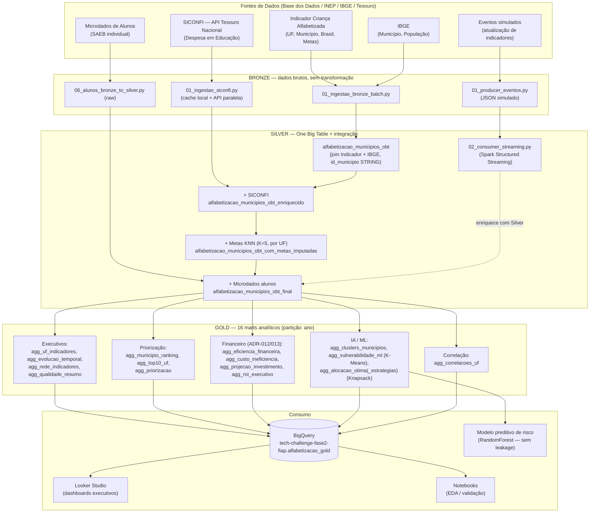
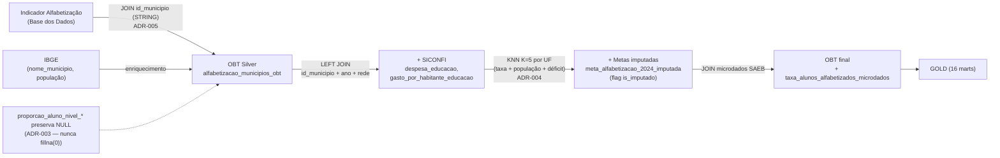
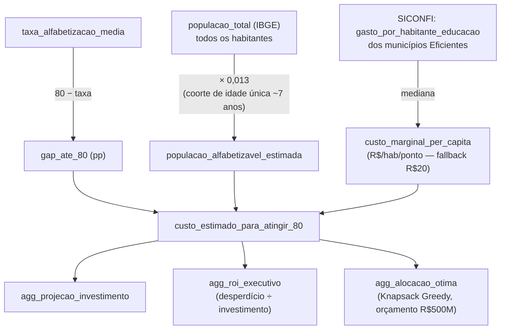

# Diagrama da Pipeline — Alfabetização no Brasil

> Renderiza nativamente no GitHub (Mermaid). Complementa o README com a visão
> de arquitetura e o fluxo de dados exigidos no enunciado do Tech Challenge.

## 1. Arquitetura geral (Medalhão híbrido: Batch + Streaming, GCP)

## 2. Fluxo de dados — camada Silver (integração das bases)

## 3. Fluxo de custo/priorização (ADR-012 + ADR-013 — o modelo econômico)

## Notas de leitura

- **Batch** cobre Indicador de Alfabetização, IBGE, SICONFI e microdados — dados históricos, reprocessados periodicamente.
- **Streaming** (Spark Structured Streaming / File Stream, ver ADR-006) simula atualização quase-tempo-real de indicadores; arquitetura pronta para trocar a fonte por Kafka sem reescrever a lógica de consumo.
- Os 3 diagramas cobrem exatamente os itens do enunciado: "descrição da arquitetura da solução", "diagrama da pipeline" e "fluxo de dados".
- Fonte de verdade do modelo econômico: `src/cloud/dataproc_03_gold.py` (produção/BigQuery) e, após o fix de 2026-07-06, também `src/gold/01_gerar_marts_gold.py` (local) — ver `docs/adr/ADR-012-modelo-custo-marginal.md` e `ADR-013-fracao-populacao-alfabetizavel.md`.
